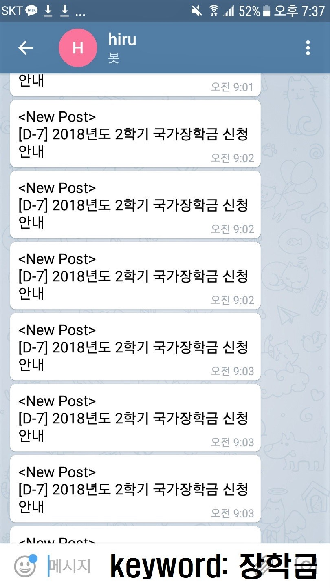

# Keyword-Crawling-Project
Crawl a certain keyword in the website and notify the new post with that keyword to the user via mobile phone on 24-hour base

## Detail
A real-time website keyword notification service to smartphones &nbsp;&nbsp;&nbsp;&nbsp;&nbsp;&nbsp;&nbsp;&nbsp;&nbsp;&nbsp;&nbsp;&nbsp; May. 2018 - Jun. 2018
* Created a Python code that pulls data out of HTML (Beautiful Soup), stores in a text file format and sends a push notification to user’s smartphone when user’s keyword matches the content of the data (ex. new post in school’s website) 
* Managed to run the code on the AWS service using ‘Amazon Linux AMI’ so that the code can be run on the background on 24 hours real-time basis.

## Result

